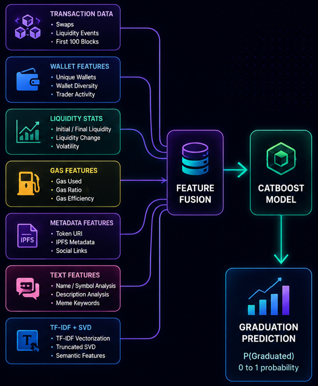
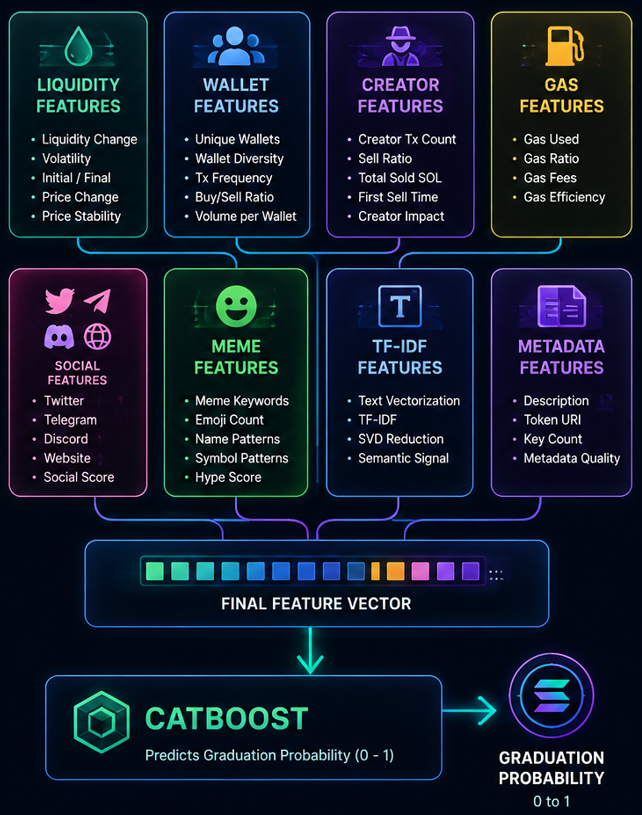

# Solana Skill Sprint — Memcoin Graduation Prediction

Machine learning pipeline for predicting whether newly launched Pump Fun memecoins on Solana will graduate to high liquidity pools using only the first 100 blockchain blocks after mint.

This project achieved a **Top 13 Global Rank** in the Solana Skill Sprint Kaggle competition.

---

# Overview

Most Pump Fun tokens fail shortly after launch.

Some survive long enough to:
- accumulate liquidity
- attract community attention
- graduate to Raydium / PumpSwap

The goal of this project was to predict whether a token would reach:

```text
85 SOL liquidity
```

using only:
- early transaction behavior
- wallet activity
- liquidity patterns
- metadata
- social/IPFS information

available within the first 100 blocks after token creation.

---

# Competition

Competition:
- Solana Skill Sprint — Memcoin Graduation

Task:
- Binary classification

Target:
- Predict whether a token graduates

Evaluation Metric:
- Log Loss

---

# Final Ranking

🏆 [**Top 13 Global Rank**](https://www.kaggle.com/competitions/solana-skill-sprint-memcoin-graduation/leaderboard)

---


# Architecture Overview



---

# Feature Engineering Overview



This diagram summarizes the major categories of engineered features used in the final CatBoost model, including:
- liquidity dynamics
- creator wallet behavior
- meme/text analysis
- IPFS metadata enrichment
- social presence indicators
- trading activity statistics

---

# Dataset

The dataset contains:
- transaction-level blockchain activity
- token metadata
- liquidity information
- wallet interactions
- IPFS metadata links

Dataset Link:

https://www.kaggle.com/datasets/dremovd/pump-fun-graduation-february-2025

---

# Problem Statement

Given only the first 100 blocks after a token mint:

predict whether the token will eventually graduate to high liquidity pools.

The challenge was difficult because:
- most tokens behave similarly early on
- many tokens are rugged quickly
- deployers attempt to hide malicious patterns
- early trading activity is highly noisy

The key was extracting subtle behavioral and liquidity signals.

---

# Core Idea

The solution focused heavily on:
- feature engineering
- wallet behavior analysis
- metadata enrichment
- liquidity dynamics
- text and meme analysis

instead of deep neural networks.

A large amount of signal came from:
- creator behavior
- liquidity evolution
- transaction timing
- social presence
- meme-related naming patterns

---

# Key Components

## 1. Transaction Feature Engineering

The first stage aggregates raw transaction chunks into token-level features.

Features extracted include:

### Liquidity Features
- initial liquidity
- final liquidity
- liquidity change
- liquidity volatility

### Trading Features
- buy/sell counts
- buy ratios
- SOL volume statistics
- transaction frequency

### Price Features
- price volatility
- price change
- normalized price range
- price stability metrics

### Wallet Features
- wallet diversity
- unique traders
- wallet concentration

### Gas Features
- gas efficiency
- consumed gas
- gas fee statistics

---

# Creator Behavior Analysis

One of the strongest signals came from creator wallet activity.

We engineered features such as:
- creator sell ratio
- creator sell timing
- creator total sold SOL
- creator transaction count
- creator liquidity impact

These features helped identify:
- rug pull behavior
- aggressive dumping
- suspicious creator patterns

---

# IPFS Metadata Enrichment

The pipeline asynchronously scraped metadata from:
- token URLs
- token URI endpoints
- IPFS metadata

using:
- asyncio
- aiohttp

This enriched the dataset with:
- descriptions
- social links
- metadata structure

---

# Social Presence Features

We extracted indicators for:
- Twitter/X
- Telegram
- Discord
- websites

and combined them into:
- social presence scores

Projects with stronger social metadata often showed better graduation probability.

---

# Meme & Text Analysis

Memecoin naming patterns contain surprisingly strong signals.

We engineered features from:
- token names
- symbols
- descriptions

including:
- meme keyword counts
- emoji usage
- uppercase ratios
- special characters
- positive/negative word frequencies

Examples:
- pepe
- moon
- doge
- shib
- pump
- ape

---

# TF-IDF + SVD Text Features

To capture semantic information from descriptions:

we used:
- TF-IDF vectorization
- Truncated SVD dimensionality reduction

This added compressed text representations into the final feature set.

---

# Model

The final model used:

```text
CatBoostClassifier
```

Reasons:
- excellent handling of tabular data
- robust with noisy features
- strong categorical feature support
- minimal preprocessing requirements
- fast experimentation

---

# Training Strategy

The pipeline used:
- Stratified 5-Fold Cross Validation
- GPU training (when available)
- early stopping
- out-of-fold validation

Key training parameters:

| Parameter | Value |
|---|---|
| Iterations | 10000 |
| Learning Rate | 0.03 |
| Depth | 8 |
| CV Folds | 5 |
| Early Stopping | 150 |

---

# Feature Categories

The final model used 50+ engineered features across:

| Category | Examples |
|---|---|
| Liquidity Features | liquidity change, volatility |
| Wallet Features | wallet diversity, tx frequency |
| Creator Features | sell ratios, creator activity |
| Gas Features | gas efficiency, gas fees |
| Text Features | meme keywords, emoji counts |
| Social Features | Twitter, Telegram, Discord |
| Metadata Features | descriptions, token URI |
| NLP Features | TF-IDF + SVD embeddings |

---

# Asynchronous Metadata Scraping

A major part of the pipeline involved large-scale metadata enrichment.

The scraper:
- asynchronously fetched IPFS metadata
- handled retries/timeouts
- processed thousands of URLs concurrently

Technologies:
- asyncio
- aiohttp
- nest_asyncio

This significantly improved:
- metadata coverage
- social feature extraction
- text feature quality

---

# Repository Structure

```text
solana-memecoin-graduation-prediction/
│
├── memcoin_prediction.ipynb
│
├── assets/
│   ├── pipeline.png
│   ├── architecture.png
│   ├── leaderboard.png
│   └── feature_overview.png
│
├── requirements.txt
├── .gitignore
└── README.md
```

---

# Installation

Clone repository:

```bash
git clone https://github.com/sqqshh/Solana-Skill-Sprint-Memcoin-Graduation-Prediction.git
cd solana-memecoin-graduation-prediction
```

Install dependencies:

```bash
pip install -r requirements.txt
```

---

# Running Training

Run the notebook:

```bash
memcoin_prediction.ipynb
```

The notebook includes:
- feature engineering
- metadata enrichment
- TF-IDF generation
- CatBoost training
- cross-validation
- inference
- submission generation

---

# Submission Format

Final submission file:

```text
mint,has_graduated
token_1,0.93
token_2,0.14
...
```

where:
- `has_graduated` is the predicted probability of graduation

---

# Technologies Used

- Python
- CatBoost
- pandas
- NumPy
- scikit-learn
- asyncio
- aiohttp
- TF-IDF
- Truncated SVD

---

# Key Learnings

This project taught me:
- large-scale feature engineering
- blockchain transaction analysis
- behavioral modeling
- async data enrichment
- practical NLP feature extraction
- efficient tabular ML optimization
- competition-oriented experimentation

It also demonstrated how much predictive signal exists in:
- creator behavior
- early liquidity activity
- metadata quality
- social presence

even within the first few blockchain blocks.

---

# Future Improvements

Potential future directions:
- graph neural networks
- wallet interaction graphs
- temporal sequence models
- real-time inference systems
- transformer-based transaction modeling
- multimodal token metadata analysis
- on-chain anomaly detection

---

# Acknowledgements

- Solana Skill Sprint
- Kaggle
- CatBoost
- Solana ecosystem datasets
- Pump Fun
